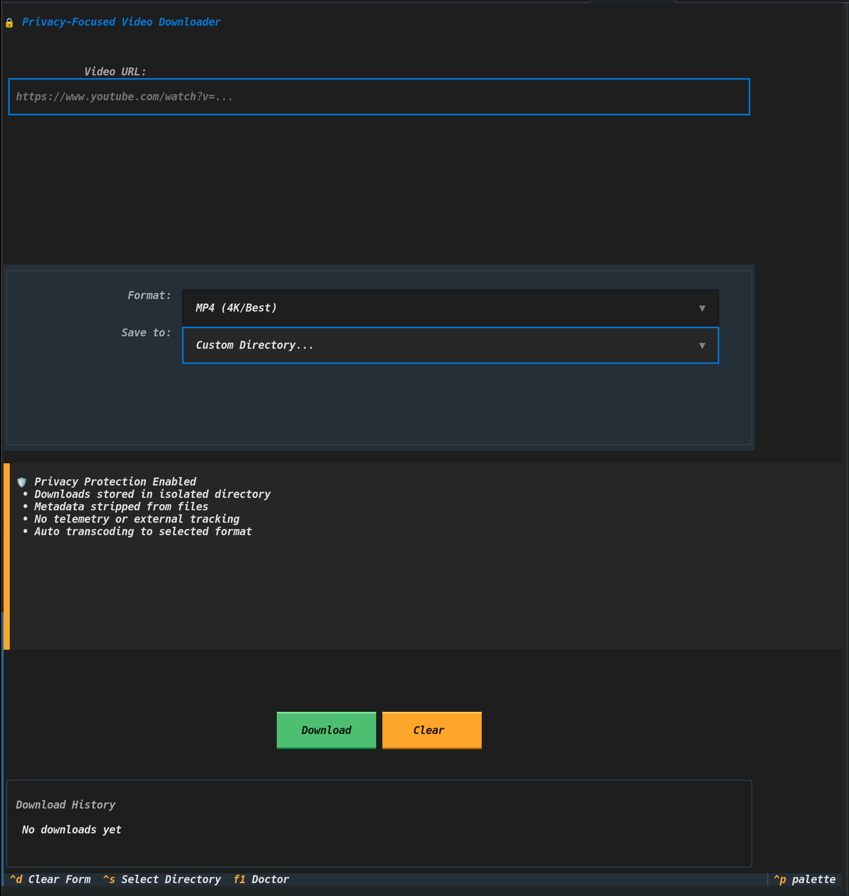
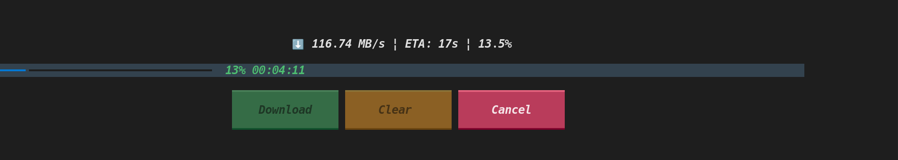
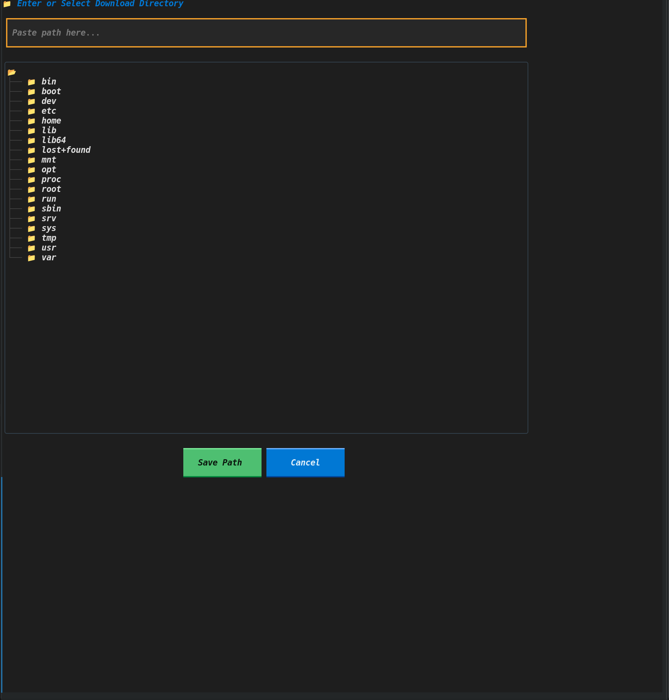

# 🔒 Simple YouTube Downloader

> A privacy-focused YouTube video downloader with a beautiful terminal UI

[](https://python.org)
[](https://textual.textualize.io)
[](LICENSE)

## 🎯 Why This Exists?

In a world where every download tool tracks your usage, **simple-yt-dlp** takes a different approach:

**🔒 Privacy by Design:**
- **Zero telemetry** - No analytics, no phone-home, ever
- **Metadata stripping** - Downloads are cleaned of all identifying information
- **Isolated storage** - Downloads go to a dedicated private directory
- **No leftovers** - No infojson files or temporary metadata

**🎨 Beautiful Experience:**
- Modern TUI that's a joy to use
- Visual progress with speed and ETA
- Remember your preferences between sessions

Unlike web-based downloaders that track what you watch, or clunky command-line tools that require memorizing options, simple-yt-dlp gives you a clean, private, and beautiful way to save videos.

---

## ✨ Features

- 🎨 **Beautiful TUI** - Modern terminal interface built with [Textual](https://textual.textualize.io)
- 🛡️ **Privacy-First** - Strips metadata, no telemetry, isolated downloads
- ⚡ **Fast & Responsive** - Async execution, non-blocking UI
- 📁 **Smart Formats** - Video (MP4/MKV/WebM) & Audio (FLAC/MP3/OPUS)
- 💾 **Persistent Config** - Remembers your settings
- 📜 **Download History** - Track your recent downloads
- 🗂️ **Directory Selection** - Easy save location management
- 🍪 **Cookie Support** - Download age-restricted and private videos
- 📝 **Debug Logging** - Easy troubleshooting with file-based logs
- 🔄 **Auto-Retry** - Automatically handles 403 errors by clearing cache and retrying
- 🔍 **Doctor Screen** - Press F1 to diagnose system status (FFmpeg, yt-dlp, paths)

## 📸 Screenshots

### Main Interface
<!-- TODO: Add screenshot -->


### Download in Progress
<!-- TODO: Add screenshot -->


### Directory Selection
<!-- TODO: Add screenshot -->


## 🚀 Quick Start

### Prerequisites

- **Python 3.9+** - [Download Python](https://python.org)
- **FFmpeg** - Required for video merging and format conversion
  - **Linux**: `sudo apt install ffmpeg`
  - **macOS**: `brew install ffmpeg`
  - **Windows**: `winget install ffmpeg`

### Installation

#### Using pip (Recommended)

```bash
# Clone the repository
git clone https://github.com/Boooob626/simple-yt-dlp.git
cd simple-yt-dlp

# Install in editable mode
pip install -e .

# Run the app
simple-yt-dlp
```

#### Using uv (Faster)

```bash
# Install uv if you haven't already
pip install uv

# Clone and run
git clone https://github.com/Boooob626/simple-yt-dlp.git
cd simple-yt-dlp
uv run simple_yt_dlp.py
```

#### Run directly

```bash
python simple_yt_dlp.py
```

## 📋 Supported Formats

### Video Formats
| Format | Quality | Description |
|--------|---------|-------------|
| MP4 | 4K/1080p/720p/480p/360p | Universal compatibility |
| MKV | Best | Maximum quality |
| WebM | Best | High compression |
| MOV | Best | Apple compatible |

### Audio Formats
| Format | Quality | Description |
|--------|---------|-------------|
| FLAC | Lossless | Perfect for archiving |
| WAV | Lossless | Uncompressed audio |
| M4A | High | Apple AAC format |
| OPUS | High | Modern compression |
| MP3 | 192kbps | Universal compatibility |

## 🔒 Privacy Features

- ✅ Metadata stripped from all downloads
- ✅ No telemetry or phone-home
- ✅ Isolated download directory
- ✅ No infojson files saved
- ✅ User agent spoofing for bot protection
- ✅ Clean filenames with restricted characters removed

## ⌨️ Keyboard Shortcuts

| Key | Action |
|-----|--------|
| `Ctrl+C` | Quit |
| `Ctrl+D` | Clear form |
| `Ctrl+S` | Select directory |
| `F1` | Open Doctor diagnostics |
| `Ctrl+P` | Open command palette |
| `Tab` | Navigate between fields |

## 🛠️ Development

### Setting up development environment

```bash
# Clone the repository
git clone https://github.com/Boooob626/simple-yt-dlp.git
cd simple-yt-dlp

# Create virtual environment
python -m venv .venv
source .venv/bin/activate  # On Windows: .venv\Scripts\activate

# Install with development dependencies
pip install -e ".[dev]"

# Run tests
pytest
```

### Code formatting

```bash
# Format code with ruff
ruff format .

# Lint code
ruff check .
```

## 🔧 Troubleshooting

### "FFmpeg not found" error

Install FFmpeg for your platform:
- **Linux**: `sudo apt install ffmpeg` (Debian/Ubuntu) or `sudo dnf install ffmpeg` (Fedora)
- **macOS**: `brew install ffmpeg`
- **Windows**: Download from [ffmpeg.org](https://ffmpeg.org/download.html) or run `winget install ffmpeg`

### "No module named 'yt_dlp'" error

```bash
pip install yt-dlp
```

### Update yt-dlp (Important!)

YouTube frequently changes its architecture, which can break older versions of yt-dlp.

```bash
# Update to the latest version
pip install -U yt-dlp

# Or if using uv
uv pip install -U yt-dlp
```

### Verify your setup

Run the included check script:

```bash
python check_tools.py
```

This will verify:
- yt-dlp installation
- FFmpeg availability
- Optional dependencies

## 📝 License

This project is licensed under the [MIT License](LICENSE).

## 🙏 Acknowledgments

- [yt-dlp](https://github.com/yt-dlp/yt-dlp) - YouTube downloader core
- [Textual](https://textual.textualize.io) - Beautiful TUI framework
- [FFmpeg](https://ffmpeg.org) - Video processing

## 🤝 Contributing

Contributions are welcome! Please feel free to submit a Pull Request.

1. Fork the repository
2. Create your feature branch (`git checkout -b feature/amazing-feature`)
3. Commit your changes (`git commit -m 'Add amazing feature'`)
4. Push to the branch (`git push origin feature/amazing-feature`)
5. Open a Pull Request

## 📧 Contact

- GitHub Issues: [github.com/Boooob626/simple-yt-dlp/issues](https://github.com/Boooob626/simple-yt-dlp/issues)

---

Made with ❤️ and [Textual](https://textual.textualize.io)
